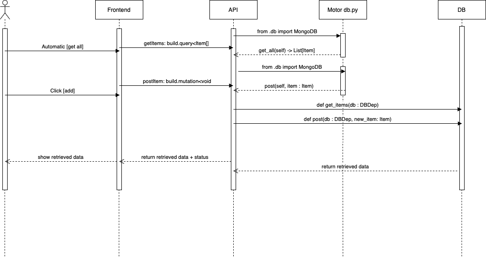
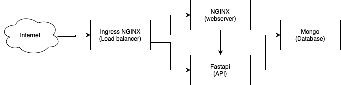

# Project overview

Kubernetes project for the course Software Containerization
The API is written in Python FastAPI
The front end is done in React with Typescript
DB is MongoDB.

### Sequence diagram



### Deployment diagram



# Instructions Local

## To build and run everything Locally

```bash
chmod +x code_to_run_it.sh
./code_to_run_it.sh
```

## the script does:

### inside the dockerfile folder build the images

To build different docker images you will use the following

```bash
docker build -t api-service:latest ./api
docker build -t ui-service:latest ./frontend
```

### Place the images in microk8s registry

tag the images for registry

```bash
docker tag api-service:latest localhost:32000/api-service:latest
docker tag ui-service:latest localhost:32000/ui-service:latest
```

You can push images to registery of microk8s through:

push the images to registry

```bash
docker push localhost:32000/api-service:latest
docker push localhost:32000/ui-service:latest
```

## Deployment Helm Local

To install the whole project through Helm use:

```bash
microk8s.helm install <release_name> ./k8s/
```

## Release new version Helm Local

To a rolling update deploymement, do:

```bash
microk8s.helm upgrade <release_name> ./k8s/
```

## Rollback Helm Local

To a rolling update deploymement, do:

```bash
microk8s.helm rollback <release_name>/
```

## Uninstallation with Helm local

To uninstall a release:

```bash
microk8s.helm uninstall <release_name>
```

# Instructions Cloud

## Packaging

```bash
helm package k8s-gke/charts/api/
```

## Putting in repo of gcp

```bash
helm push k8s-0.1.0.tgz oci://europe-web1-docker.pkg.dev/subtle-backup-413213/software-containerization-repo
```

## Installation

```bash
helm install k8s-test oci://europe-west1-docker.pkg.dev/subtle-backup-413213/software-containerization-repo/api-service --version 0.1.0
```

## Uninstallation

```bash
helm uninstall k8s-test
```

# Validation

## HPA

This command is for showing that the autoscaler is applied

```bash
kubectl run -i -n ingress --tty load-generator --rm --image=busybox:1.28 --restart=Never -- /bin/sh -c "while sleep 0.005; do wget -q -O- http://k8s-test-api-service.default.svc.cluster.local:8081/api/; done"
```

## Network policy

### Verify frontend and backend

```bash
kubectl run --rm -i -t --image=alpine test-$RANDOM -n ingress -- sh
\# wget -qO- http://k8s-test-api-service.default.svc.cluster.local:8081/
\# wget -qO- http://k8s-test-ui-service.default.svc.cluster.local:8081/
```
