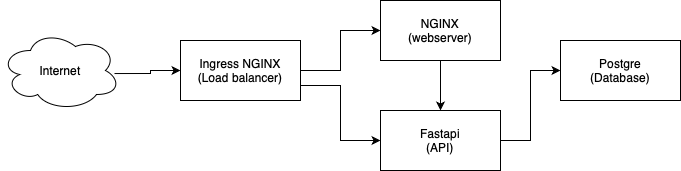

# Containerization course vu


##inside the dockerfile folder build the images
```bash
docker build -t image_name .
```

##place the images in microk8s registry
```bash
docker save image_name > myimage.tar
microk8s ctr image import myimage.tar
```

##List images in microk8s to check that is there
```bash
microk8s ctr images ls
```

##Apply deployment
```bash
microk8s kubectl apply -f
```

## DEADLINE - TO DO

<!-- - 18 - deadline for frontend otherwise @quarti jumps on it
- unknown - UML @quarti
- 18 - soft deadline for kubernetes oporting supporting api external access, and horizontal scaling
- 16 - 8pm heads up on kubernetes material
- 16 - 8pm heads up on lecture 4 persistant volumes -->

| Deadline | Responsible | Task                             |
| -------- | ----------- | -------------------------------- |
| 28-01    | ?           | Release: Rolling Update & Canary |
| 29-01    | Daniele     | UML                              |
| 2-02     | Daniele     | HTTPS and certmanager            |
| 30-01    | Daniele     | Sketch Generic diagram           |
| 31-01    | Daniele     | Sketch Presentation on google    |




| Section                                                          | Responsible |
| ---------------------------------------------------------------- | ----------- |
| 1 Architecture and Artifacts                                     | Daniele     |
| 2 Pre-requisite                                                  | Kuhn        |
| 3 Container build and first deployment, scaling, uninstallation  | Daniele     |
| 4 Application upgrade and re-deployment                          | Kuhn        |
